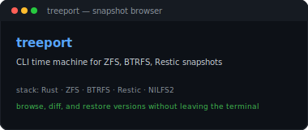
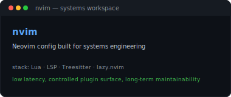
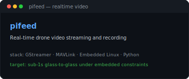
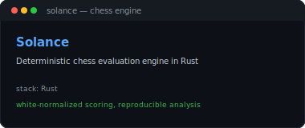
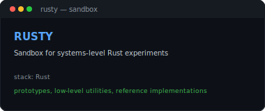
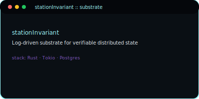

    
  

  

    
  

 

    
    
    
    
    
    
  

 

## Projects

  <table width="100%">
    <tr>
      <td width="50%" valign="top">
        
      </td>
      <td width="50%" valign="top">
        
      </td>
    </tr>
    <tr>
      <td width="50%" valign="top">
        
      </td>
      <td width="50%" valign="top">
        
      </td>
    </tr>
    <tr>
      <td width="50%" valign="top">
        
      </td>
      <td width="50%" valign="top">
        
      </td>
    </tr>
  </table>

 

## Stack

  #### Languages
  

    
    
    
    
    
    
    
    
    
    
  

  #### Systems & OS
  

    
    
    
    
    
    
  

  #### Infrastructure
  

    
    
    
    
    
    
    
  

  #### Embedded & Hardware
  

    
    
    
  

  #### Tools
  

    
    
    
    
    
  

 

## Active

  - **[treeport](https://codeberg.org/Fawz-Haaroon/TREE-PORT)** — CLI snapshot browser for ZFS, BTRFS, Restic. v0.50.0 shipped
  - **[pifeed](https://github.com/Fawz-Haaroon/pifeed)** — Real-time drone video pipelines under embedded bandwidth constraints
  - **stationInvariant** — System invariants and correctness under load _(private)_
  - **telemetry-core** — Observability backend; metrics as first-class design _(pre-release)_

 

## GitHub

  

    
  

  

    
    
  

 

## Activity

  

    
  

 

## Doctrine

  - Production over demos. If it only works on your laptop, it does not exist.
  - Metrics over opinions. If you cannot measure it, you cannot claim it.
  - Abstractions are cost centers until proven otherwise.
  - Observability is architecture, not an add-on.
  - Tooling — nvim, shell, wm — is part of the system, not decoration.

  > A system that cannot explain itself under stress is already broken.
