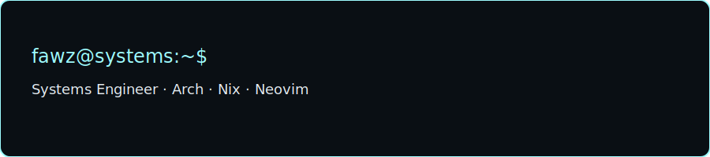
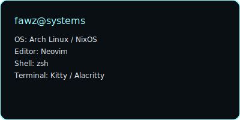

<picture>
  <source media="(prefers-color-scheme: dark)" srcset="assets/headers/hero-terminal.svg" />
  <source media="(prefers-color-scheme: light)" srcset="assets/headers/hero-glitch.svg" />
  
</picture>

```text
███████  █████  ██     ██ ███████     ██   ██  █████   █████  ██████   ██████   ██████  ███    ██ 
██      ██   ██ ██     ██    ███      ██   ██ ██   ██ ██   ██ ██   ██ ██    ██ ██    ██ ████   ██ 
█████   ███████ ██  █  ██   ███       ███████ ███████ ███████ ██████  ██    ██ ██    ██ ██ ██  ██ 
██      ██   ██ ██ ███ ██  ███        ██   ██ ██   ██ ██   ██ ██   ██ ██    ██ ██    ██ ██  ██ ██ 
██      ██   ██  ███ ███  ███████     ██   ██ ██   ██ ██   ██ ██   ██  ██████   ██████  ██   ████ 
                                                                                                    
                       Systems Engineer | Arch · Nix · Neovim
```
### Connect

<p align="center">
  <a href="https://github.com/Fawz-Haaroon"></a>
</p>
### System Identity


### Telemetry

<p align="center">
  
</p>

<p align="center">
  
</p>

<p align="center">
  
</p>

<p align="center">
  
</p>

<p align="center">
  
</p>

<p align="center">
  
  
</p>
### Proof of Work

#### pifeed

```text
PIFEED
Modular real-time video streaming and recording system for autonomous drones.

Stack: GStreamer · MAVLink · Embedded Linux
Focus: real-time video pipelines under unstable links and hardware limits.
Repo: https://github.com/Fawz-Haaroon/pifeed
```

#### Profile Telemetry

```text
PROFILE DASHBOARD
This repository. GitHub profile as a systems dashboard.

Stack: GitHub Actions · SVG · Markdown
Focus: observable profile, auto-updated metrics, zero fake data.
Repo: https://github.com/Fawz-Haaroon/Fawz-Haaroon
```
### Stack Matrix

#### Languages
<p>
  
  
  
  
  
  
  
  
  
  
</p>

#### Systems & OS
<p>
  
  
  
  
  
</p>

#### Infrastructure
<p>
  
  
  
  
  
  
  
</p>

#### Embedded & Hardware
<p>
  
  
  
</p>

#### Tools & Workflow
<p>
  
  
  
  
  
</p>
### Current Focus

List up to three active systems projects or research threads. Each line must point to a real repository or document.

Examples (replace with your current work):

- **pifeed** — Real-time video pipeline for autonomous drones · [repo](https://github.com/Fawz-Haaroon/pifeed)
- **[project-name]** — One-line purpose · [repo](https://github.com/Fawz-Haaroon/your-repo)
- **[research-note]** — Short description · link to real write-up
### Activity Graphs


### Code Metrics

Real coding activity metrics (WakaTime or equivalent) will be wired here once an account is configured. Until then, only GitHub contribution data is exposed.
### Widgets

#### Contribution Snake


#### Typing Banner


### Trophies


### Visitor Analytics


## Identity

**Name:** Fawz Haaroon  
**Role:** Systems Engineer  
**Operating Domain:** Linux, low-level software, networking, observability, embedded systems  
**Primary Mode:** Terminal-first engineering  

I don’t build demos. I build systems that survive real load, real failure, and real constraints.  
I care about how software behaves under stress, not how it looks in slides.

---

## What I Actually Do

I work in the layers where performance, correctness, and operability collide:

- Design and implement **systems-level software**
- Build **networked and embedded pipelines** where latency, hardware limits, and reliability matter
- Engineer **observability-first backends**: metrics, tracing, and failure visibility are part of the architecture, not add-ons
- Treat **tooling and workflow as part of the system** (editor, shell, build chain, deployment)

I don’t chase frameworks. I analyze cost, memory, scheduling, and failure modes.

---

## How I Think About Systems

- **Production > Demos**  
  If it only works on your laptop, it doesn’t exist.

- **Metrics > Opinions**  
  If you can’t measure it, you can’t claim it.

- **Abstractions Hide Cost**  
  Every layer has a price. I track it.

- **Observability Is Architecture**  
  Tracing, logging, and metrics are not “afterwards.” They are structural components.

- **10× Load Is the Baseline**  
  Any system that cannot explain its behavior at 10× traffic is not production-ready.

---

## Engineering Doctrine

- I optimize for **correctness, debuggability, and operational clarity** before raw speed.  
- I distrust **black-box frameworks, magic defaults, and fashionable abstractions**.  
- A system is **bad** if it cannot explain itself when it fails.  
- A system is **good** if it degrades predictably, exposes its state, and can be reasoned about under pressure.

---

## What I Build

- **Systems software** (low-level, performance-aware)
- **Embedded and constrained pipelines**
- **Networking-heavy architectures**
- **Observability-first backends**
- **Developer tooling as infrastructure**

I am not a frontend engineer. I am not a “full-stack” generalist. I do not optimize for presentation.

---

## Tooling & Environment

- **OS:** Arch Linux / NixOS  
- **Editor:** Neovim (custom configuration, workflow as architecture)  
- **Shell:** zsh  
- **Philosophy:** The environment is part of the system

---

## What I Explicitly Reject

- “Passionate about technology”
- “Driven by innovation”
- Skill bars and self-rated percentages
- Abstractions that hide runtime cost
- Systems that look clean but fail silently
- Claims without code, metrics, or evidence

If it cannot be traced, measured, or reasoned about, it does not belong in my work.

---

## Personal Rule

> **A system that cannot explain itself under stress is already broken.**  
> Measure everything. Trust nothing. Build for operators, not for demos.
