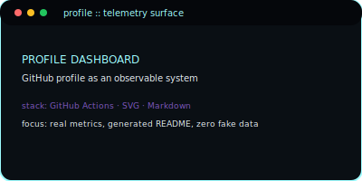
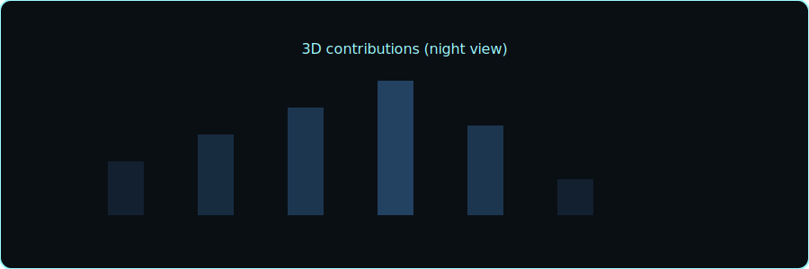

<p align="center">
  
</p>

<p align="center">
  
</p>

```text
                             *                
                            ***               
                           **:*               
                          *+++++              
                         +******+             
                        ++++++++++            
                       /++++++++++/           
                -+syhddmmmmmmmmmmdhs/-        
             :ydmmmmmmmmmmmmmmmmmmmmmmy:     
          `/ymmmmmmmmmmmmmmmmmmmmmmmmmmd/    
        .+mmmmmmmmmmmmmmmmmmmmmmmmmmmmmmh.   
       .ymmmmmmmmmmmmmmmmmmmmmmmmmmmmmmmmh-  
      `dmmmmmmmmmmmmmmmmmmmmmmmmmmmmmmmmmd+  
      ommmmmmmmmmmmmmmmmmmmmmmmmmmmmmmmmmm+  
      ymmmmmmmmmmmmmmmmmmmmmmmmmmmmmmmmmmm/  
      yMMMMMMMMMMMMMMMMMMMMMMMMMMMMMMMMMMm/  
      yMMMMMMMMMMMMMMMMMMMMMMMMMMMMMMMMMMm/  
      yMMMMMMMMMMMMMMMMMMMMMMMMMMMMMMMMMMm/  
      yMMMMMMMMMMMMMMMMMMMMMMMMMMMMMMMMMMm/  
      yMMMMMMMMMMMMMMMMMMMMMMMMMMMMMMMMMMm/  
      yMMMMMMMMMMMMMMMMMMMMMMMMMMMMMMMMMMm/  
      /ssssssssssssssssssssssssssssssssss+   

User        lextron  [home:/home/lexitron/]
Host        Strelizia
OS          Arch Linux  x86_64
Kernel      Linux 6.18.3-arch1-2
Packages    2176 (pacman) · 11 (flatpak)
DE / WM     Hyprland 0.53.1 (Wayland)
CPU         12th Gen Intel(R) Core(TM) i7-1255U [C:4+8] 4.70 GHz
GPU         Intel Iris Xe Graphics [C:96] 1.25 GHz
Memory      8.07 GiB / 15.29 GiB (52%)
Disk        227.37 GiB / 359.62 GiB (63%)
```
### Connect

<p align="center">
  <a href="https://github.com/Fawz-Haaroon"></a>
  <a href="mailto:fawzhaaroon216@gmail.com"></a>
  <a href="https://www.linkedin.com/in/fawz-haaroon"></a>
  <a href="https://x.com/FawzHaaroon"></a>
  <a href="https://leetcode.com/Fawz--Haaroon"></a>
  <a href="https://www.codechef.com/users/Fawz--Haaroon"></a>
  <a href="https://codeforces.com/profile/Fawz_Haaroon"></a>
  <a href="https://stackoverflow.com/users/Fawz-Haaroon"></a>
  <a href="https://instagram.com/algorithm_euphoria"></a>
</p>
### Telemetry

<table>
  <tr>
    <td colspan="2" align="center">
      
    </td>
  </tr>
  <tr>
    <td align="center">
      
    </td>
    <td align="center">
      
    </td>
  </tr>
  <tr>
    <td align="center">
      
    </td>
    <td align="center">
      
    </td>
  </tr>
</table>
### Proof of Work

<p align="center">
  <a href="https://github.com/Fawz-Haaroon/pifeed">
    
  </a>
</p>

<p align="center">
  <a href="https://github.com/Fawz-Haaroon/nvim">
    
  </a>
</p>

<p align="center">
  <a href="https://github.com/Fawz-Haaroon/stationInvariant">
    
  </a>
</p>

<p align="center">
  <a href="https://github.com/Fawz-Haaroon/Fawz-Haaroon">
    
  </a>
</p>
### Stack Matrix

#### Languages
<p>
  
  
  
  
  
  
  
  
  
  
</p>

#### Systems & OS
<p>
  
  
  
  
  
  
</p>

#### Infrastructure
<p>
  
  
  
  
  
  
  
</p>

#### Embedded & Hardware
<p>
  
  
  
</p>

#### Tools & Workflow
<p>
  
  
  
  
  
</p>
### Current Focus

Active systems work right now:

- **stationInvariant** — Research on system invariants and correctness under load. _(private for now)_
- **telemetry-core** — Observability-first backend core; metrics and introspection as first-class design. _(design and experiments, repo will be public when real)_
- **pifeed** — Real-time drone video pipelines under bandwidth and hardware constraints · [repo](https://github.com/Fawz-Haaroon/pifeed)
### Activity Graphs

<table>
  <tr>
    <td align="center">
      
    </td>
  </tr>
  <tr>
    <td align="center">
      
    </td>
  </tr>
</table>
### Code Metrics

Real coding activity metrics (WakaTime or equivalent) will be wired here once an account is configured. Until then, only GitHub contribution data is exposed.
### Widgets

<table>
  <tr>
    <td align="center">
      
    </td>
    <td align="center">
      
    </td>
  </tr>
</table>
### Trophies


### Visitor Analytics


## Doctrine

- Production over demos. If it only works on your laptop, it does not exist.
- Metrics over opinions. If you can’t measure it, you can’t claim it.
- Abstractions are cost centers until proven otherwise.
- Observability is architecture, not an add-on.
- Tooling (nvim, shell, wm) is part of the system, not decoration.

> **A system that cannot explain itself under stress is already broken.**  
> Measure everything. Trust nothing. Build for operators, not for demos.
